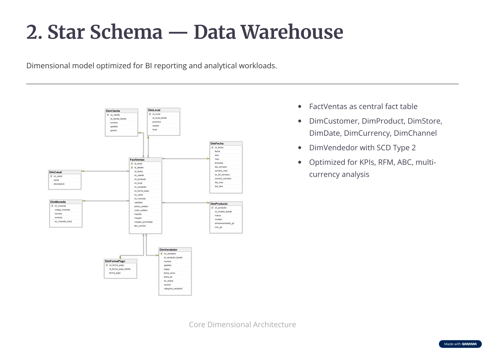
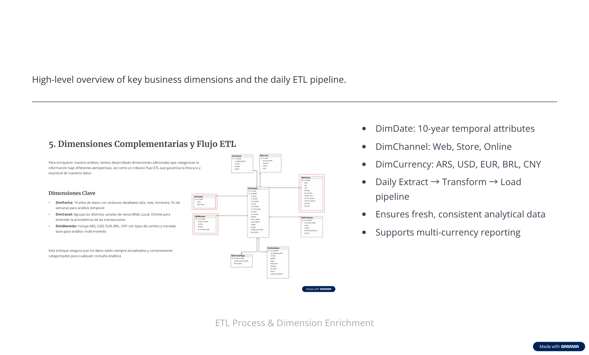

# 📊 Retail Sales Data Warehouse — SQL & Python

[](https://www.microsoft.com/sql-server)
[](https://www.python.org/)
[](https://jupyter.org/)
[](LICENSE)

Enterprise-grade Data Warehouse built with **SQL Server**, **Python**, and **dimensional modeling (Kimball)**. Includes OLTP modeling, ETL pipelines, SCD Type 2, multi-currency support, and analytical SQL/Python workflows.

---

## 🔷 1. Business Context

This project simulates the analytical backbone of a retail cellphone company.

### ✔ Strategic Objectives

- Sales performance analysis across stores, brands, models, channels
- RFM segmentation & customer lifecycle insights
- ABC/Pareto analysis for product profitability
- Seller performance tracking (Top / Medium / Low)
- Multi-currency reporting: ARS, USD, EUR, BRL, CNY
- BI-ready datasets for Power BI & Python

*This architecture is representative of a real Canadian retail BI system.*

---

## 🔷 2. Architecture Overview

```
OLTP (Normalized 3NF)
      ↓ ETL
Data Warehouse (Star Schema)
      ↓
SQL Analytics + Python + Power BI
```

---

## 🔷 3. OLTP Model — Transactional Layer

Operational data model used as the source system for the DW.

**Features:**
- ✔ 9 normalized tables
- ✔ Referential integrity enforced
- ✔ Real-time operations
- ✔ Source for ETL extraction

### 🖼 ERD


*Figure 1: Normalized OLTP schema with referential integrity constraints.*

---

## 🔷 4. Star Schema — Analytical Data Warehouse

Dimensional model optimized for BI, KPIs, aggregations and advanced analysis.

### Dimensions

- **DimDate** — Date dimension with temporal attributes
- **DimCustomer** — Customer profiles
- **DimProduct** — Products (brand, model, specs)
- **DimStore** — Store locations
- **DimChannel** — Sales channels (Web / Store)
- **DimCurrency** — Multi-currency support
- **DimPaymentMethod** — Payment methods
- **DimSeller** — Sellers with **SCD Type 2** versioning

### Fact Table

- **FactSales** — Quantities, revenue, margins, multi-currency metrics

### 🖼 ERD



*Figure 2: Star schema with fact table and dimension tables optimized for analytical queries.*

---

## 🔷 5. ETL Pipeline & Dimensions

Daily automated ETL ensuring fresh, consistent analytical data.

### Pipeline

1. **Extract** from OLTP
2. **Transform** (business rules, currency conversion)
3. **SCD Type 2** for sellers (versioning)
4. **Load** DW tables (facts & dimensions)

### Key Dimensions

- **DimDate**: 10-year temporal attributes (year, month, quarter, weekday)
- **DimChannel**: Web / Store / Online
- **DimCurrency**: ARS, USD, EUR, BRL, CNY

### 🖼 ETL Flow Diagram



*Figure 3: ETL pipeline with dimension population and incremental load strategy.*

---

## 🔷 6. Advanced Analytics

Implemented in SQL and Python.

### ✔ Temporal Analytics
- YoY / MoM growth rates
- Moving averages
- Running totals
- Trend analysis

### ✔ Segmentation
- **ABC / Pareto** analysis
- **RFM** segmentation (Champions, Loyal, At Risk, Lost)

### ✔ Performance
- Best seller by revenue
- Best store by profit margin
- Top brand/model

### ✔ Multi-Currency
- Correct conversion with historical exchange rates
- Aggregation-safe metrics
- Multi-currency reporting (ARS, USD, EUR, BRL, CNY)

---

## 🔷 7. Project Structure

```
retail-sales-data-warehouse-sql-refactored/
├── 01_base_datos/          # Database creation scripts
├── 02_oltp/                # OLTP DDL and data load
├── 03_datawarehouse/       # DW schema definitions
├── 04_etl/                 # ETL initial and incremental
├── 05_consultas/           # Analytical SQL queries
├── 06_analisis/            # Jupyter notebooks
├── 07_validacion/          # Data quality validation
├── 08_scripts_auxiliares/  # Helper scripts
├── 09_documentacion/       # Documentation
├── sql/                    # Organized SQL scripts
│   ├── ddl/
│   ├── dml/
│   └── views/
├── src/                    # Python modules
│   ├── etl/
│   └── utils/
├── notebooks/              # Analysis notebooks
├── data/                   # Raw and processed data
├── img/                    # Architecture diagrams
└── docs/                   # Technical documentation
```

---

## 🔷 8. How to Run

### 📋 Prerequisites

- SQL Server 2017+ (Developer or Express Edition)
- Python 3.9+
- SSMS or Azure Data Studio (optional)

### 🚀 SQL Server Setup

```sql
-- 1. Create databases
:r 01_base_datos/00_creacion_bases.sql

-- 2. OLTP schema
:r 02_oltp/01_ddl_oltp.sql

-- 3. Load sample data
:r 02_oltp/02_carga_oltp.sql

-- 4. DW schema
:r 03_datawarehouse/03_ddl_dw.sql

-- 5. Initial ETL
:r 04_etl/04_etl_dw_inicial.sql
```

### 🔄 Incremental ETL

```sql
-- Daily refresh
:r 04_etl/05_reproceso_diario.sql
```

### 🐍 Python Setup

```bash
# Install dependencies
pip install -r requirements.txt

# Launch Jupyter
jupyter notebook notebooks/Notebook_Estadistica_Ventas.ipynb
```

### 📊 Run Analytical Queries

```sql
-- Execute any query from 05_consultas/
:r 05_consultas/09_analisis_abc_pareto.sql
:r 05_consultas/10_analisis_rfm.sql
```

---

## 🔷 9. Technologies

| Category | Tools |
|----------|-------|
| **Database** | SQL Server 2017+ |
| **Languages** | T-SQL, Python 3.9+ |
| **Python Stack** | Pandas, SQLAlchemy, Matplotlib, Seaborn, Plotly |
| **BI Tools** | Power BI, Jupyter Notebooks |
| **IDEs** | VS Code, SSMS, Azure Data Studio |
| **Version Control** | Git, GitHub |

---

## 🔷 10. Key Features Summary

- ✅ **OLTP → DW** full pipeline with initial and incremental ETL
- ✅ **SCD Type 2** for seller dimension versioning
- ✅ **Multi-currency** support with historical exchange rates
- ✅ **Star schema** optimized for analytical queries
- ✅ **Advanced analytics**: ABC/Pareto, RFM, temporal analysis
- ✅ **Python integration**: Jupyter notebooks with visualization
- ✅ **Production-ready**: Data quality validation, helper scripts

---

## 📝 License

MIT License — see [LICENSE](LICENSE) for details.

## 👤 Author

**Ramiro Ottone Villar**

[](https://github.com/rAmIro-89)
[](https://www.linkedin.com/in/ramiro-ottone-villar)

---

*Built with ❤️ for Canadian tech market — showcasing enterprise-grade data engineering and analytics skills.*


